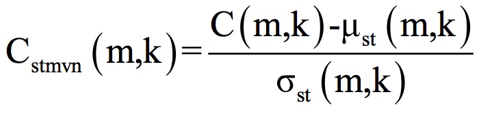
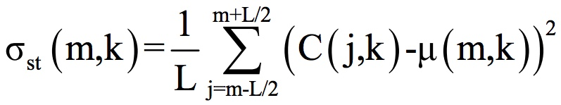

# Short-time Mean and Variance Normalization (STMVN)

STMVN applied to MFCC matrices.

This is my optimized implementation of a normalization from the paper:
https://www.crim.ca/perso/patrick.kenny/Jahangir_nolisp2011_16_final.pdf

---

The paper states:

*In the short-time mean and variance normalization (STMVN) technique, m-th frame
and k-th feature space C(m,k) are normalized as:*




*where m and k represent the frame index and cepstral coefficients index,
respectively, L is the sliding window length in frames. μst(m,k) and σst(m,k) are the
short-time mean and standard deviation, respectively, defined as:*




---

This normalization turns out to show interesting results. Furthermore, in a practical application, a short-term variance is easier to compute than a normalization over all available samples in a dataset.

However, this normalization is heavy regarding computations. Indeed at every frame the mean and variance is computed using the neigbhour frames. At the timestamp t, frames [t-L/2, ..., t+L/2] are used to compute mean and variance. At the timestamp t+1, frames [t-L/2+1, ..., t+L/2+1] are used to compute mean and variance.

Rather than recomputing mean and variance from scratch at every single time step we can instead compute the **reccurence formulas** of the mean and variance, which implies much less computations.


---

We generate a random MFCC matrix of 1000 frames and compute the STMVN normalization with both methods, smart one and brute one.

```python
N= 1000
MFCC_matrix= np.random.rand(N, 13)

mfcc1= mfcc_stmvn_smart_way(MFCC_matrix)
mfcc2= mfcc_stmvn_brute_way(MFCC_matrix)
```
