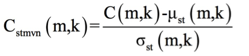
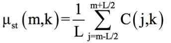
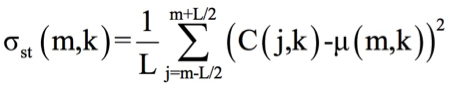
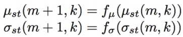
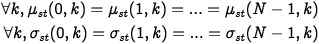
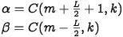
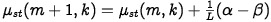
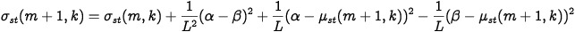
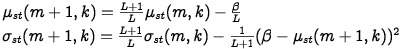
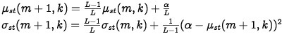

# Optimised Short-time Mean and Variance Normalization (STMVN)

STMVN applied to MFCC matrices.

## Paper

This is my optimized implementation of the "STMVN normalization" from the paper:
https://www.crim.ca/perso/patrick.kenny/Jahangir_nolisp2011_16_final.pdf

---


## Concept

The paper states:

*In the short-time mean and variance normalization (STMVN) technique, m-th frame
and k-th feature space C(m,k) are normalized as:*



*where m and k represent the frame index and cepstral coefficients index,
respectively, L is the sliding window length in frames. μst(m,k) and σst(m,k) are the
short-time mean and standard deviation, respectively, defined as:*





---

This normalization turns out to show interesting results. Furthermore, in a practical application, a short-term variance is easier to compute than a normalization over all available samples from a dataset.

However, this normalization is heavy regarding computations. Indeed at every frame the mean and variance is computed using the neighbor frames. At the timestamp t, frames `[t-L/2, ..., t+L/2]` are used to compute mean and variance. At the timestamp t+1, frames `[t-L/2+1, ..., t+L/2+1]` are used to compute mean and variance.

Rather than recomputing mean and variance from scratch at every single frame we can instead find the **recurrence relations** of the mean and variance, which implies much less computations.

## Recurrence relations

The idea is to compute following recurrence relations:



There are several cases, several sub domains, one of them being really simple:

For **L >= N**, L being the sliding window length and N the total number of frames, the neighbor frames for each frame are the same and thus μst and σst are equals along all the frames. In that case we just need to compute μst and σst once, as indeed:



---

For **L < N**, we have to compute the recurrence relations.

We introduce α and β:



One can prove that:






---

One can prove that:



---

One can prove that:




## Results

Let's generate a random MFCC matrix of 1000 frames and compute the STMVN normalization with both methods, smart one and brute one.

```python
N= 1000
MFCC_matrix= np.random.rand(N, 13)

mfcc1= mfcc_stmvn_smart_way(MFCC_matrix)
mfcc2= mfcc_stmvn_brute_way(MFCC_matrix)
```

When comparing the two matrices we see that:

```python
np.array_equal(mfcc1, mfcc2)
>>> False

abs(np.mean(mfcc1 - mfcc2))
>>> 1.87582564582e-15

np.allclose(mfcc1, mfcc2, rtol=1e-10, atol=1e-10)
>>> True
```

At the first glance results seem wrong, both arrays aren't equal. But computing the absolute average of the differences element wise we find out that it's really tiny, 10E-15 order.
Indeed with a 1e-10 tolerance both arrays are equal.
**This tiny neglectable difference can be explained by the unprecise float computations.**

Now we highlight the computations saving of this method. We repeat many times (here a hundred times) the computation of the normalization using both methods and compute the average time for each method:

```python
brute_avg_time= 0
smart_avg_time= 0
nb_samples= 100
for _ in range(nb_samples):
    MFCC_matrix= np.random.rand(N, 13)

    t0= time.time()
    mfcc1= mfcc_stmvn_smart_way(MFCC_matrix)
    smart_avg_time+= time.time() - t0

    t0= time.time()
    mfcc2= mfcc_stmvn_brute_way(MFCC_matrix)
    brute_avg_time+= time.time() - t0

smart_avg_time
>>> 0.0263386082649
brute_avg_time
>>> 1.23926760674
```

Interestingly, **we get a ratio of around 47**. That means complexity has been *roughly divided* by 50 using the recurrence formulas which is a great time saving.
